# EMCFsys 用户使用说明

> EMCFsys 是面向电子显微镜图像的 napari 插件，提供图像预处理、超分辨率、分类、语义分割、实例分割、数据集转换、数据集检查、模型管理和表型分析功能。

## 1. 安装与启动

在已经配置好的环境中启动 napari：

可以参考Github官方文档安装napari: [https://github.com/napari/napari](https://github.com/napari/napari) 或者通过napari官网 [napari.org/stable/index.html](https://napari.org/stable/index.html)

或者直接参考[ReadMe.md](../README.md)进行环境配置、napari安装和emcfsys插件安装

安装成功后，打开napari的Plugins进行安装emcfsys插件（如在中国境内，请连接VPN进行下载）
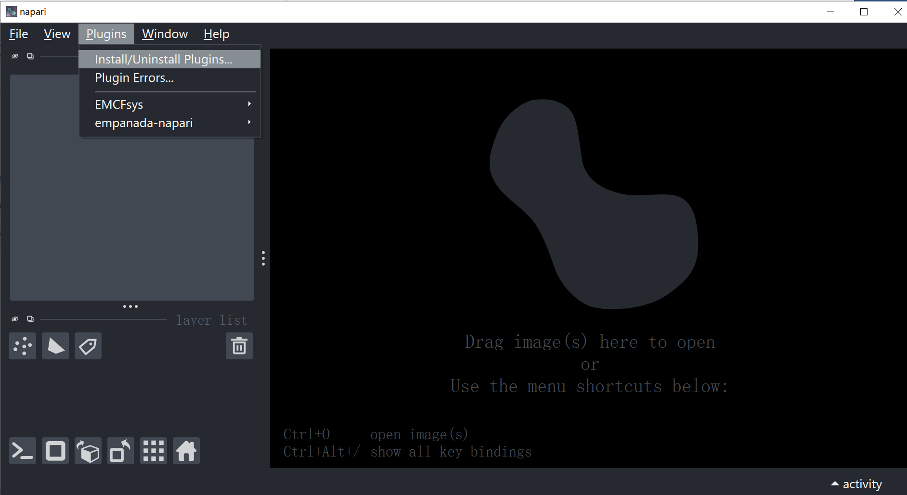
And you can find emcfsys plugin.
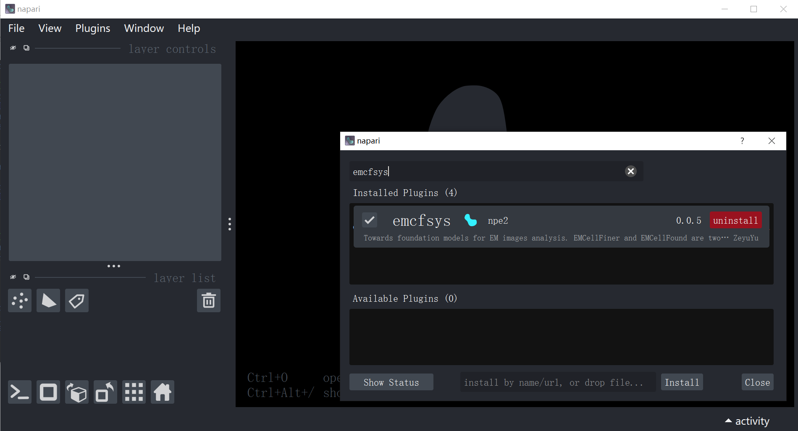

插件安装完成后，打开 napari 菜单栏中的 `Plugins`，在 `EMCFsys` 分组中可以看到各项功能。插件当前按模块命名，便于在较多功能中快速定位。

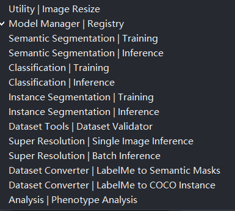

### 1.1 功能菜单

| 菜单分组              | 功能                                                 | 用途                                 |
| --------------------- | ---------------------------------------------------- | ------------------------------------ |
| Utility               | Image Resize                                         | 调整图像大小并生成新的 napari 图层   |
| Model Manager         | Registry                                             | 持久化管理训练结果和模型             |
| Semantic Segmentation | Training / Inference                                 | 语义分割训练和单张、滑窗或文件夹推理 |
| Classification        | Training / Inference                                 | 图像分类训练和预测                   |
| Instance Segmentation | Training / Inference                                 | COCO 实例分割训练和预测              |
| Dataset Tools         | Dataset Validator                                    | 检查语义分割、实例分割和分类数据集   |
| Super Resolution      | Single / Batch Inference                             | EMCellFiner 单张或批量超分辨率       |
| Dataset Converter     | LabelMe to Semantic Masks / LabelMe to COCO Instance | 将 LabelMe 标注转换为训练数据        |
| Analysis              | Phenotype Analysis                                   | 根据图像和标签实例计算形态及强度特征 |

## 2. 通用使用规则

### 2.1 默认模型和Demo

模型默认加载云端权重，比如EMCellFound、EMCellFiner的路径留空时，插件会自动在后台从github链接中下载模型权重并加载，初次使用时请耐心等待模型下载完成。如果加载失败，请确认网络情况。或手动加载模型路径（EMCellFiner、EMCellFound（MAE或Dinov3））。

如果模型始终无法下载或加载，请手动下载模型，并将模型pth文件放置在/models/路径下，运行时，会优先查找本地模型进行调用。

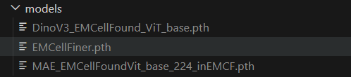

测试和使用Demo请查看[demo_notebook.ipynb](../demo_notebook.ipynb)

### 2.2 图像和标签的形状

- 2D 电子显微镜图像通常使用 `H x W` 数组。推理模型默认支持Napari读取的2D图像。
- RGB/RGBA 图像可以使用 `H x W x C` 形式。推理模型会自动转换图像格式。
- 语义分割 mask 应为单通道类别 ID 图像，不应把彩色预览图当作训练标签（除非是带有Palatte的png格式，本质上是单通道类别ID图像），语义分割图像和标签的名称应该一一对应，后缀格式默认图像为tif，标签为png。语义分割数据推荐使用labelme进行标注，并使用Dataset converter工具进行转换。
- 预测结果通常以新的 `Image` 或 `Labels` 图层加入 napari，不会覆盖原始图层。
- 训练和推理的 `Image size`、类别数、backbone、head 必须与模型配置一致。

### 2.3 路径和文件名

训练数据中的图像和标注应尽量使用相同文件主名，例如：

```text
image/cell_001.tif
label/cell_001.png
```

路径中尽量避免未授权的网络盘、临时盘和过长路径。模型、配置、日志建议保存到同一个训练结果文件夹，便于 Model Manager 自动扫描。

### 2.4 训练结果文件

训练完成后，保存目录通常包含：

```text
training_result/
├── *.pth 或 *.pt              # 模型权重
├── config.json                # 训练配置
├── training_log.csv           # 训练过程日志
└── metrics.json               # 最终指标或验证指标
```

模型管理器可以扫描这些文件，并在之后重新打开 napari 时从持久化 registry 恢复记录。删除 registry 记录不会删除磁盘上的模型文件。

### 2.5 开放模型与测试数据集路径

EMCellFound(MAE) :[MAE_EMCellFoundVit_base_224_inEMCF.pth](https://github.com/yzy0102/emcfsys/releases/download/EMCFsys/MAE_EMCellFoundVit_base_224_inEMCF.pth)

EMCellFound(DinoV3):：[DinoV3_EMCellFound_ViT_base.pth](https://github.com/yzy0102/emcfsys/releases/download/EMCFsys/DinoV3_EMCellFound_ViT_base.pth)

EMCellFiner：[EMCellFiner.pth](https://github.com/yzy0102/emcfsys/releases/download/EMCFsys/EMCellFiner.pth)

8类细胞器分类数据集：[huggingface.co/datasets/Zeyu0102/EightOrganelleClassification](https://huggingface.co/datasets/Zeyu0102/EightOrganelleClassification)

植物细胞器语义分割数据集：[huggingface.co/datasets/Zeyu0102/EMCF_PlantSegDataset](https://huggingface.co/datasets/Zeyu0102/EMCF_PlantSegDataset)

Liver-6 3D reconstruct数据集：[huggingface.co/datasets/Zeyu0102/liverdataset](https://huggingface.co/datasets/Zeyu0102/liverdataset)

线粒体实例分割数据集：[huggingface.co/datasets/Zeyu0102/EMCFsys_MitoInstanceSegDataset](https://huggingface.co/datasets/Zeyu0102/EMCFsys_MitoInstanceSegDataset)

## 3. Utility | Image Resize

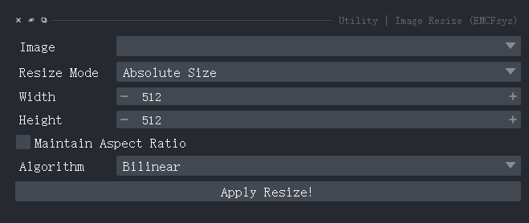

Image Resize 用于在 napari 中生成指定大小或指定倍率的新图像层，适合在模型推理前统一输入尺寸，也适合快速准备推理图像。

### 3.1 参数说明

| 控件                  | 说明                                                      |
| --------------------- | --------------------------------------------------------- |
| Image                 | 选择当前 viewer 中的图像层                                |
| Resize Mode           | `Absolute Size` 使用宽高；`Scale Factor` 使用缩放倍率 |
| Width / Height        | 绝对尺寸模式下的目标宽度和高度                            |
| Scale X / Scale Y     | 倍率模式下的水平和垂直缩放倍率                            |
| Maintain Aspect Ratio | 保持宽高比，避免图像被拉伸                                |
| Algorithm             | 最近邻、双线性、双三次或 Lanczos 插值                     |

`Nearest Neighbor` 适合类别标签或离散 mask；普通灰度图像通常使用 `Bilinear` 或 `Bicubic`。调整大小后点击 `Apply Resize!`，插件会创建新图层，原图层仍然保留。

## 4. Model Manager | Registry

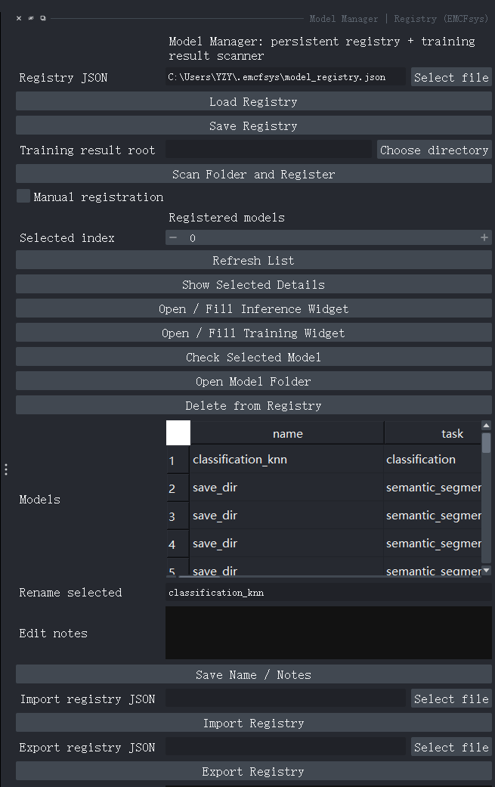

Model Manager 是持久化模型 registry，不要求所有模型位于同一个文件夹。它保存模型的名称、任务类型、checkpoint、配置、指标和备注等路径信息。

### 4.1 Registry 文件

默认 registry 路径为：

```text
~/.emcfsys/model_registry.json
```

也可以通过环境变量 `EMCFSYS_MODEL_REGISTRY` 指定位置。使用 `Load Registry` 读取已有 registry，使用 `Save Registry` 写入当前记录。registry 是索引文件，不是模型权重的副本。

### 4.2 扫描训练结果

1. 在 `Training result root` 选择一个训练结果根目录。
2. 点击 `Scan Folder and Register`。
3. 插件查找 checkpoint、`config.json`、`metrics.json` 和 `training_log.csv`。
4. 扫描到的结果会加入列表，并保存到 registry。

如果模型和训练结果分别位于多个目录，可以分别扫描各目录。扫描不会移动或复制原始模型。

### 4.3 手动注册

默认情况下手动注册字段隐藏。勾选 `Manual registration` 后才会显示模型名称、任务类型、checkpoint、配置、指标、日志和备注字段。手动注册适合：

- 权重来自外部训练框架；
- 权重和配置不在同一个训练目录；
- 需要为一个模型补充说明或人工指定任务类型。

点击 `Register / Update` 后保存 registry。路径必须指向实际存在的文件，任务类型必须与后续推理模块匹配。

### 4.4 模型列表与一键调用

选择模型后可以使用：

| 按钮                         | 作用                                |
| ---------------------------- | ----------------------------------- |
| Refresh List                 | 重新读取当前 registry               |
| Show Selected Details        | 查看完整路径、配置、指标和备注      |
| Open / Fill Inference Widget | 打开对应推理界面并填入模型参数      |
| Open / Fill Training Widget  | 打开对应训练界面并填入训练配置      |
| Check Selected Model         | 检查 checkpoint、配置和日志是否存在 |
| Open Model Folder            | 在文件管理器中打开模型目录          |
| Delete from Registry         | 只删除 registry 记录，不删除文件    |
| Rename selected / Edit notes | 修改模型显示名和备注                |
| Import / Export Registry     | 导入或导出一份 registry JSON        |

重新打开 napari 后，只要 registry JSON 仍然存在且路径没有变化，模型记录即可恢复。若模型被移动，使用 `Check Selected Model` 确认缺失项，再通过手动注册或导入新的 registry 修正路径。

## 5. Semantic Segmentation | Training


语义分割为每个像素预测类别 ID，适合背景、细胞器或组织区域等类别互不重叠的任务。

### 5.1 数据目录

不使用 split 文件时，推荐组织为：

```text
semantic_dataset/
├── images/
│   ├── sample_001.tif
│   └── sample_002.tif
└── masks/
    ├── sample_001.png
    └── sample_002.png
```

`Images folder` 选择 `images`，`Masks folder` 选择 `masks`。图像与 mask 必须按主文件名匹配，mask 中的像素值就是类别 ID，背景通常为 0。文件夹名称本身不是强制要求，只要两个字段指向正确的图像和单通道 mask 目录即可。

### 5.2 Split 文件

勾选 `Use split files (train/val/test)` 后，会显示三个路径字段。三个文件必须位于同一个 `splits` 目录，并严格命名：

```text
splits/
├── train.txt
├── val.txt
└── test.txt
```

每行写一个图像主名或相对文件名（无需图像格式后缀），例如 `sample_001`。`train.txt` 和 `val.txt` 用于训练与验证，`test.txt` 会被记录为后续推理或测试使用的数据，不会被当作训练数据。未勾选时保持现有行为，由训练流程按验证比例进行划分。

### 5.3 模型和训练参数

| 控件             | 建议                                                                                                        |
| ---------------- | ----------------------------------------------------------------------------------------------------------- |
| Pretrained model | 可选：已有训练完整的模型（注意不是EMCellFound权重，而是整体分割模型的权重），用于在已有模型基础上继续训练。 |
| Backbone         | 根据显存和数据规模选择；预训练权重必须与 backbone 对应                                                      |
| Model            | `deeplabv3plus`、`unet`、`pspnet`、`upernet`、`mask2former` 等                                    |
| Classes num      | 类别总数，必须包含背景（1+分割类别数）其中1为背景                                                           |
| Target size      | 送入模型的目标尺寸（推荐512×512）                                                                          |
| Batch size       | 显存不足时先减小该值                                                                                        |
| Learning rate    | 小数据集可从较小值开始（EMCellFound默认使用较小值进行微调）                                                 |
| Ignore index     | 不参与 loss 和指标计算的像素 ID                                                                             |
| Device           | `auto`、`cpu` 或 `cuda`                                                                               |

`Training preset` 可快速设置一组参数：`Custom`、`Balanced Default`、`Fast Debug`、`Small Organelle`、`Boundary Sensitive` 和 `Class Imbalance`。选择 preset 会自动更新学习率、batch size、epoch、图像尺寸和损失权重；若要逐项调整，切换到 `Custom`。

### 5.4 Loss 配置

默认不勾选 `Configure advanced segmentation losses`，使用标准交叉熵 loss。勾选后可以配置以下六个辅助损失的权重：

- Dice loss：改善前景区域重叠；
- Focal loss：强调难分像素和类别不平衡；
- Tversky loss：在漏检和误检之间调整偏好；
- Boundary loss：强调目标边界；
- Lovasz-Softmax：直接改善 IoU 相关排序；
- OHEM CE：优先学习困难像素。

训练时仍保留交叉熵作为基础项，勾选框控制是否启用高级组合项，权重越大相应损失影响越大。小目标、边界模糊时可组合 Dice + Boundary；前景比例很低时可尝试 Focal 或 Tversky。不要一次把所有权重都设置很大，先观察验证集指标和 loss 曲线。

### 5.5 Mask2Former 专用项

只有当 `Model` 切换到 `mask2former` 时，GUI 才显示 matching points 设置。该选项用于 query matching 的点采样，可以选择随机点或不确定点采样；不确定点采样能够把计算集中在预测不确定区域，减少高分辨率 mask matching 的计算量。普通 DeepLab/UNet 等模型不显示该控件。

### 5.6 保存配置和训练

1. 设置数据路径、模型、类别数和训练参数。
2. 如需复现实验，先在 `Training config JSON` 指定配置路径并点击 `Save Config`。
3. 点击 `Start Training`。
4. 日志会在训练输出 dock 中显示，训练结束后生成模型、配置、CSV 日志和指标文件。
5. 使用 `Stop Training` 请求停止后台线程；已完成的文件不会被删除。

训练日志会输出 epoch 平均 loss、训练/验证总体指标，并用表格输出每类的 Val Acc、Precision、Recall、F1、Dice 和 IoU。显示的小数保留 4 位。验证集为空时不会执行验证，避免把不存在的验证结果误认为模型性能。默认保存验证集最优mIoU的模型进行保存。

## 6. Semantic Segmentation | Inference

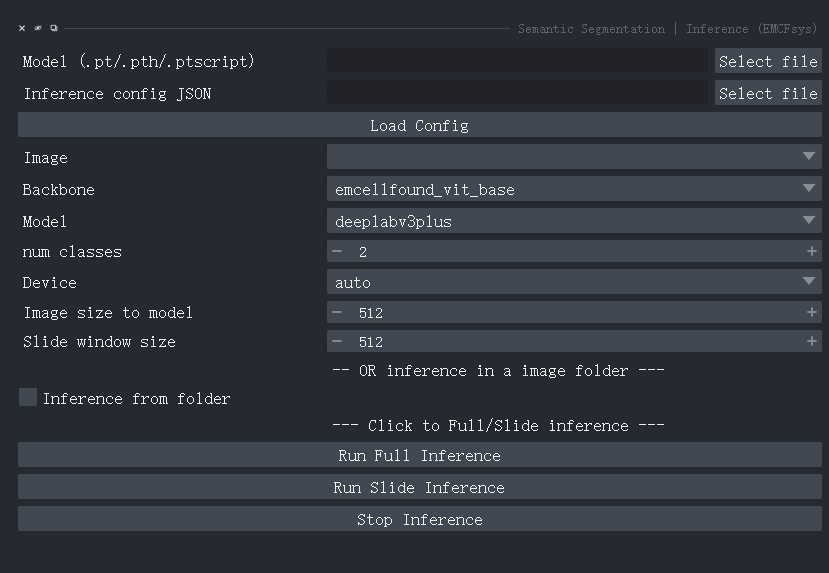

### 6.1 单张图像推理

1. 在 `Model (.pt/.pth/.ptscript)` 选择模型文件。
2. 选择当前 napari 的 `Image` 图层。
3. 设置 `Backbone`、`Model`、`num classes`、`Device` 和 `Image size to model`。
4. 点击 `Run Full Inference`。

结果会作为新的标签图层加入 viewer。模型配置和推理界面参数必须一致，尤其是 model 类型、backbone 和类别数。

### 6.2 滑窗推理

对于尺寸很大的显微镜图像，设置 `Slide window size` 后点击 `Run Slide Inference`。滑窗推理把图像分块送入模型，再把各窗口预测合并，通常比直接缩放整图更能保留小目标。窗口大小越大，显存占用越高；窗口之间的重叠和边缘处理由推理任务负责。

### 6.3 文件夹推理

勾选 `Inference from folder` 后，选择图像目录和输出目录。可以分别保存：

- 原始类别 mask：`*_mask.png`；
- 调色板可视化：`*_mask_viz.png`；
- 图像与 mask 的叠加结果：`*_mask_stack.png`。

取消 `Save visualization mask` 或 `Save stacked image + visualization` 可减少输出文件。文件夹推理同样在后台线程运行，完成或停止时会更新日志。

## 7. Classification | Training


分类任务为一张图像输出一个类别，适合细胞器 patch 或其他已经裁剪好的对象图像。

### 7.1 数据目录

优先使用已有 `train` 和 `val` 子目录：

```text
classification_dataset/
├── train/
│   ├── Mitochondria/***.png
│   └── Nucleus/***.png
└── val/
    ├── Mitochondria/***.png
    └── Nucleus/***.png
```

如果没有 `train/val`，选择包含类别子目录的总目录，插件按 `Validation split` 做分层划分。当前默认 split seed 为 42，固定数据和参数后结果应可复现；外部随机增强或改变数据文件时，结果仍可能不同。

### 7.2 Backbone、Head 和参数

- `Backbone`：选择特征提取网络；
- `Head=knn`：提取特征后建立 KNN memory bank，不进行端到端反向传播；
- `Head=linear`：在特征上训练线性分类头；
- `Use pretrained backbone`：使用预训练特征；
- `Freeze backbone for linear head`：冻结 backbone，只训练分类头；
- `KNN K` 和 `KNN metric`：配置 KNN 的邻居数以及 cosine/l2 距离；
- `Resume checkpoint`：从已有分类 checkpoint 恢复。

KNN 适合快速验证特征是否具有类别可分性。重复运行时请固定数据划分、随机种子、预训练权重和 KNN 参数，并确认没有把验证数据误放入训练目录。

### 7.3 训练输出

分类训练会保存配置、日志、指标和 checkpoint。KNN 主要输出验证准确率；线性分类器通常输出训练准确率和验证准确率。训练停止使用 `Stop Training`，不会阻塞 napari 主界面。

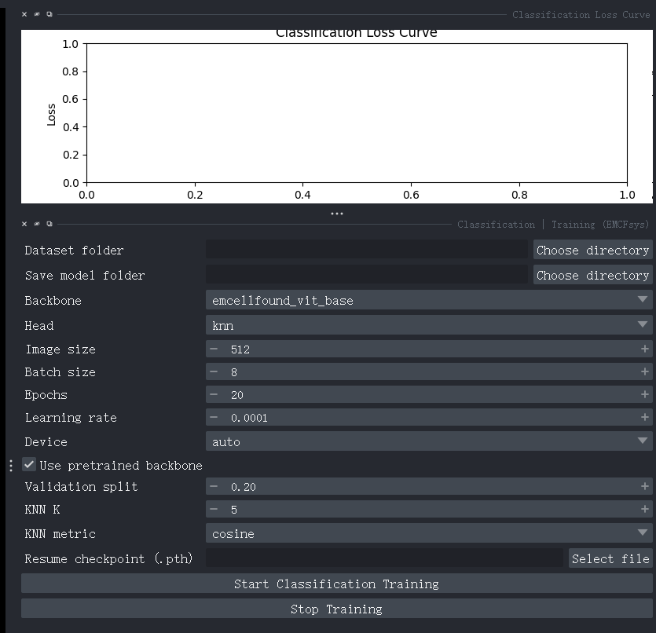

## 8. Classification | Inference

选择训练生成的 `.pth` checkpoint，指定 `Device`，即可对当前 Image 图层执行分类。该界面只有一个 checkpoint 输入，网络结构、类别名称、图像大小和分类 head 会从 checkpoint 内保存的元数据恢复，因此不需要重新填写训练参数。

| 控件                  | 用法                                                           |
| --------------------- | -------------------------------------------------------------- |
| Checkpoint (.pth)     | 选择分类训练生成的 KNN 或线性分类 checkpoint                   |
| Image                 | 单张模式下选择 napari 中待预测的图像层                         |
| Device                | `auto` 自动优先使用 CUDA；也可以强制选择 `cpu` 或 `cuda` |
| Inference from folder | 勾选后切换为文件夹批量预测，并隐藏单张 Image 选择器            |
| Image folder          | 批量预测的输入图像目录，仅在文件夹模式下显示                   |
| Output CSV            | 批量预测结果保存路径，仅在文件夹模式下显示                     |
| Run Classification    | 在后台线程中执行预测，结果写入 Classification Inference Log    |

单张模式的日志会显示 `class_name`、类别索引和四位小数 confidence。勾选 `Inference from folder` 后选择图像目录和 `Output CSV`，插件会逐张预测并写出 `path`、`class_index`、`class_name`、`confidence` 四列，便于后续统计。

使用 Model Manager 的 `Open / Fill Inference Widget` 可以自动把 checkpoint、backbone、head、类别数和设备等配置填入分类推理界面，避免手工重复输入。

## 9. Instance Segmentation | Training

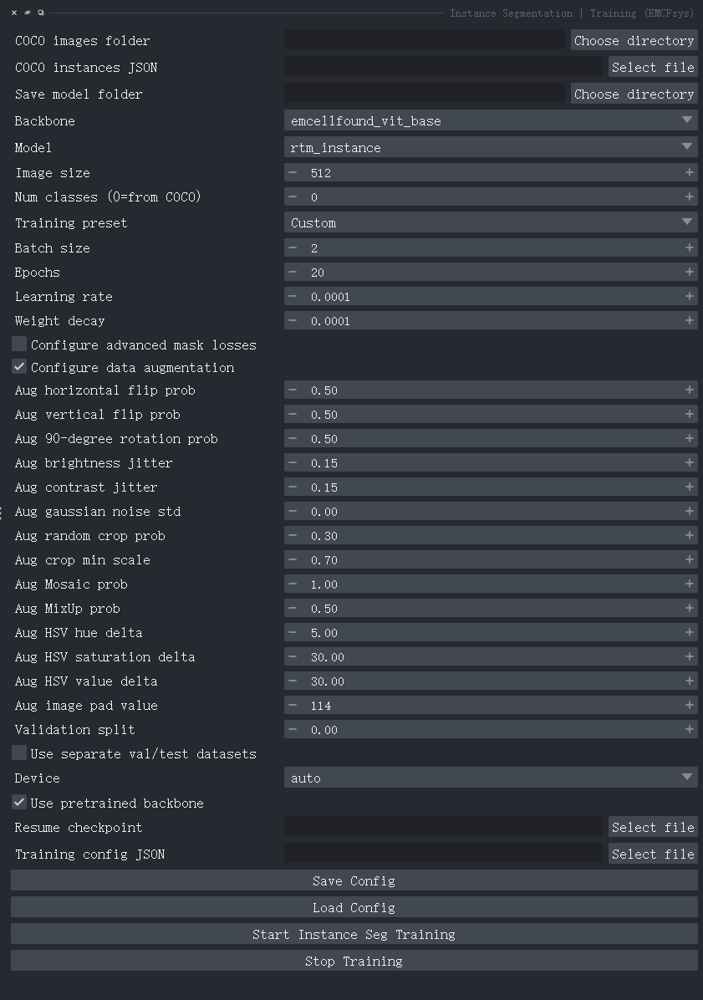

实例分割同时预测每个对象的类别、边界框和独立 mask，适合多个细胞器相互接触或同类对象需要分别计数的场景。

### 9.1 COCO 数据输入

训练需要一个图像目录和一个 COCO instances JSON：

```text
coco_dataset/
├── images/
│   ├── sample_001.tif
│   └── sample_002.tif
└── train.json
```

JSON 中保存 `images`、`annotations` 和 `categories`。图像文件由 JSON 的 `file_name` 关联，图像数据本身通常不直接嵌入 JSON。`file_name` 应能在 `COCO images folder` 下找到对应文件。

### 9.2 训练和验证设置

填写 `COCO images folder`、`COCO instances JSON`、保存目录、backbone、model、图像大小、类别数、batch size、epoch、学习率和设备。

- `num classes=0` 时可从 COCO categories 推断；需要自定义类别数时应与 JSON 一致。
- `val split > 0` 且未指定独立验证集时，训练流程会从总 JSON 划分验证数据。
- 勾选 separate val/test 后，分别填写验证和测试图像目录、annotation JSON。
- 验证和测试路径为空时，不执行对应评估。

界面字段可按以下顺序填写：

| 分组 | 关键控件                                                             | 说明                                                          |
| ---- | -------------------------------------------------------------------- | ------------------------------------------------------------- |
| 数据 | COCO images folder / COCO instances JSON                             | 必填；JSON 的`file_name` 必须能在图像目录中解析             |
| 保存 | Save model folder                                                    | 存放 checkpoint、`config.json`、`metrics.json` 和训练日志 |
| 架构 | Backbone / Model / Image size / Num classes                          | 必须与之后推理时保持一致；类别数`0` 表示从 COCO 推断        |
| 优化 | Training preset / Batch size / Epochs / Learning rate / Weight decay | preset 会填入一组建议值，`Custom` 支持自行调整              |
| 验证 | Validation split / Use separate val/test datasets                    | 二选一使用内部划分或独立 COCO 验证、测试集                    |
| 恢复 | Use pretrained backbone / Resume checkpoint                          | 前者加载预训练 backbone，后者继续已有训练                     |
| 复现 | Training config JSON / Save Config / Load Config                     | 保存、载入当前 GUI 训练参数                                   |

点击 `Start Instance Seg Training` 开始后台训练，训练曲线显示在 `Instance Segmentation Loss Curve` dock，运行中的日志显示在训练日志 dock。`Stop Training` 是停止请求，已完成的 epoch、模型和日志会保留。

### 9.3 实例分割增强

`Configure data augmentation` 控制实例分割专用增强。默认通用增强包括：

- 随机水平翻转；
- 随机垂直翻转；
- 随机 90 度旋转；
- 随机亮度和对比度扰动；
- 随机高斯噪声；
- 随机裁剪并同步裁剪 bbox 和 mask；
- 可配置 Mosaic、MixUp、HSV 扰动和 padding。

增强概率和幅度需要结合显微镜图像特点设置。旋转、翻转只改变空间方向，必须同时作用于图像、mask 和 bbox；强亮度/对比度扰动不应破坏目标与背景的基本可分性。

截图中的默认通用增强为：水平翻转 `0.50`、垂直翻转 `0.50`、90 度旋转 `0.50`、亮度和对比度扰动 `0.15`、随机裁剪概率 `0.30`、最小裁剪比例 `0.70`、Mosaic `1.00`、MixUp `0.50`、HSV hue/saturation/value 分别为 `5/30/30`、padding 值为 `114`。默认高斯噪声标准差为 `0.00`，即不添加噪声。若数据量很小且样本方向具有生物学意义，可先关闭不合适的翻转或旋转，再比较验证指标。

### 9.4 实例分割 loss

勾选 `Configure advanced mask losses` 后，可以为 Boundary mask loss、Focal mask loss 和 Tversky mask loss 设置权重。它们作为 mask 预测的辅助项使用：边界模糊时提高 Boundary，前景很小或类别不平衡时尝试 Focal，漏检代价较高时尝试 Tversky。

### 9.5 模型和评估

实例分割 head 支持当前代码注册的 `rtm_instance` 和 `mask2former_instance` 等模型。Mask2Former 选择后才会显示 matching points；点采样用于降低 query matching 的高分辨率计算量。

验证/测试阶段可以输出 COCO 风格的 mAP、AP50、AP75，并计算 mask IoU、box IoU、precision 和 recall。训练时遇到显存问题，优先减小 batch size、image size 或 matching points，再考虑缩小 backbone。

## 10. Instance Segmentation | Inference

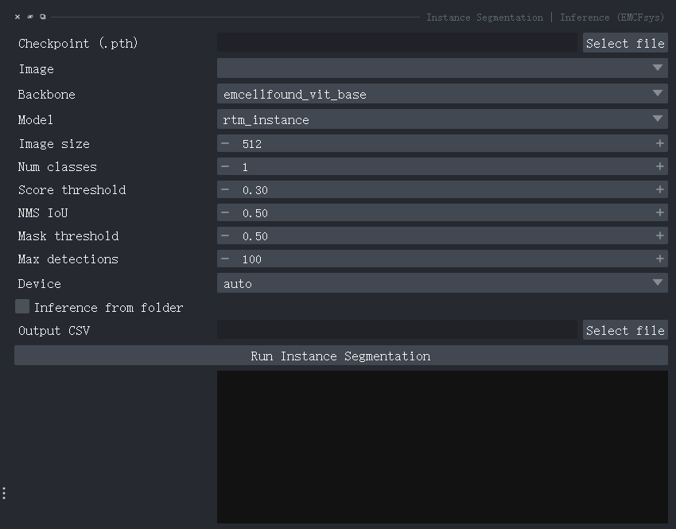

选择 checkpoint、backbone、model、图像尺寸、类别数、score threshold、NMS IoU、mask threshold、最大检测数和 device 后，点击 `Run Instance Segmentation`。这些参数的含义如下：

| 控件                     | 说明                                               |
| ------------------------ | -------------------------------------------------- |
| Checkpoint (.pth)        | 训练输出的实例分割 checkpoint                      |
| Image                    | 单张模式下的 napari 图像层                         |
| Backbone / Model         | 必须和 checkpoint 的训练架构一致                   |
| Image size / Num classes | 应与训练配置一致                                   |
| Score threshold          | 过滤低置信度候选框；低一些会提高召回，也会增加误检 |
| NMS IoU                  | 重叠候选框的去重阈值                               |
| Mask threshold           | 将概率 mask 二值化的阈值                           |
| Max detections           | 单张图像最多保留的实例数                           |
| Device                   | `auto`、`cpu` 或 `cuda`                      |
| Output CSV               | 单张或文件夹模式都可保存每个实例的结果摘要         |

单张图像模式会读取当前 Image 图层，并生成独立实例的 Labels 图层，图层名通常为 `<image_name>_instances`。输出框和实例数量会写入日志。

勾选 `Inference from folder` 后，可以选择：

- 输入图像文件夹；
- 输出 CSV；
- instance mask 输出目录；
- binary mask 输出目录。

文件夹模式会针对每张图像写出实例摘要；设置 `Instance mask output folder` 时保存整图实例 ID mask，设置 `Binary masks output folder` 时保存每个实例的二值 mask。该模式下 Image 下拉框会隐藏。若结果没有实例，先确认模型 checkpoint、类别数和图像预处理与训练时一致，再适当降低 score threshold 或 mask threshold。不要把语义分割 checkpoint 直接用于实例分割推理。

## 11. Dataset Tools | Dataset Validator

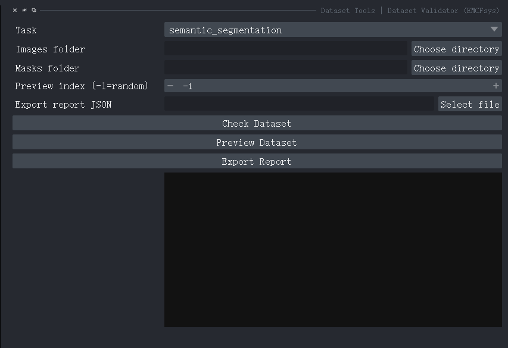

Dataset Validator 是统一数据集检查入口，支持 `semantic_segmentation`、`instance_segmentation` 和 `classification` 三种任务。

界面首先选择 `Task`。不同任务只显示必要字段：语义分割显示 `Images folder` 和 `Masks folder`；实例分割显示 `Images folder` 和 `COCO annotation JSON`；分类显示 `Classification dataset folder`。`Preview index (-1=random)` 可指定预览样本，`Export report JSON` 用于设置验证报告路径。

### 11.1 语义分割检查

选择 Images folder 和 Masks folder，点击 `Check Dataset`。工具检查图像与 mask 是否配对、尺寸是否一致、mask 是否为可识别的类别 ID，并汇总文件数量、类别值、缺失文件和异常文件。

### 11.2 实例分割检查

选择 Images folder 和 COCO annotation JSON。工具检查 JSON 结构、图像文件是否存在、annotation 的 bbox/segmentation/area/category_id 是否有效，并报告空标注、越界框和无效多边形等问题。

### 11.3 分类检查

选择分类数据集根目录，工具统计类别目录和图像数量，检查空类别目录，并按 `Preview count` 预览若干样本。

### 11.4 预览和报告

- `Preview index=-1` 表示随机预览；指定非负索引可复现查看某条样本。
- 语义分割预览会把图像和 labels 加入 viewer。
- 实例分割预览会叠加实例 labels 和黄色 bbox。
- 分类预览以网格显示样本，并保留类别信息。
- `Export Report` 输出 JSON 报告，可在训练前存档或提交给其他人检查。

## 12. Dataset Converter | LabelMe to Semantic Masks

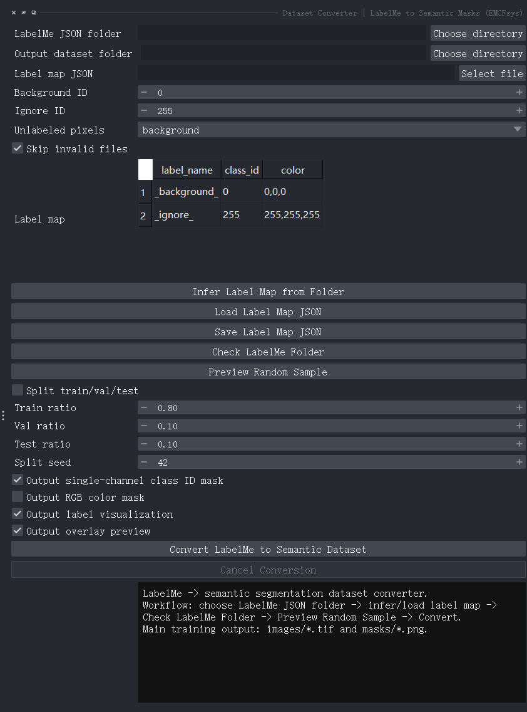

LabelMe 语义标注转换器把一个 JSON 文件夹转换为可训练的语义分割数据集。

### 12.1 LabelMe 标注要求

在 LabelMe 中，每个类别使用统一的 label 名称绘制 polygon。JSON 可以通过 `imageData` 内嵌图像，也可以通过 `imagePath` 指向外部图像。外部图像路径应相对于 JSON 所在目录可解析。

### 12.2 转换流程

1. 选择 `LabelMe JSON folder` 和输出数据集目录。
2. 点击 `Infer Label Map` 自动收集类别名称。
3. 检查 label map 中的 `label_name`、`class_id` 和颜色；必要时使用 `Load Label Map JSON` 或 `Save Label Map JSON`。
4. 设置 `Background ID`、`Ignore ID` 和未标注像素行为。
5. 点击 `Check LabelMe Folder` 检查 JSON、图像和 shapes。
6. 使用 `Preview Random Sample` 查看图像、mask 和可视化结果。
7. 如需划分数据，勾选 split，填写 train/val/test 比例和 seed。
8. 选择单通道类别 mask、RGB 颜色 mask、label visualization 和 overlay preview 等输出项。
9. 点击 `Convert LabelMe to Semantic Dataset`。

转换在子线程运行，进度会写入下方输出框，不会长时间阻塞 napari。点击 `Cancel Conversion` 后会在处理完当前 JSON 后停止。输出目录通常包含 `images/`、`masks/`、可选的 `rgb_masks/`、可视化目录以及可选的 `splits/train.txt`、`val.txt`、`test.txt`。主训练输入为 `images/*.tif` 和 `masks/*.png`；语义分割训练界面的 `Images folder` 和 `Masks folder` 应分别选择这两个目录。

## 13. Dataset Converter | LabelMe to COCO Instance

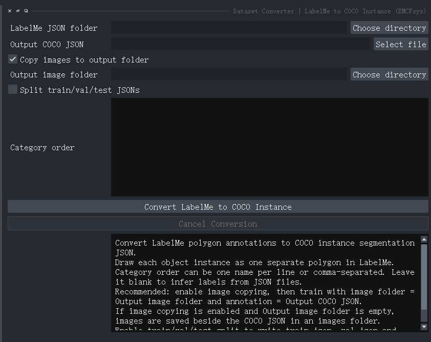

该转换器把 LabelMe 中“一个对象一个 polygon”的实例标注转换成 COCO instance segmentation JSON。

### 13.1 参数

| 控件                         | 说明                                               |
| ---------------------------- | -------------------------------------------------- |
| LabelMe JSON folder          | LabelMe JSON 所在目录                              |
| Output COCO JSON             | 主 COCO JSON 输出路径                              |
| Copy images to output folder | 是否把关联图像复制到输出目录                       |
| Output image folder          | 复制图像的目录；为空时默认在 JSON 旁建立`images` |
| Split train/val/test JSONs   | 是否按数据集拆分生成三个 COCO JSON                 |
| Train/Val/Test ratio         | 划分比例，启用 split 时使用                        |
| Split seed                   | 固定划分随机种子，默认 42                          |
| Category order               | 每行或逗号分隔一个类别名；留空则从 JSON 自动推断   |

转换后，在实例分割训练界面将 `COCO images folder` 指向输出图像目录，将 `COCO instances JSON` 指向生成的 JSON。转换器也提供 `Cancel Conversion`，进度会显示在独立的转换输出框中。

勾选 `Copy images to output folder` 时，`Output image folder` 才需要填写；若留空，插件会在主 COCO JSON 旁创建 `images/` 目录。勾选 `Split train/val/test JSONs` 后，转换器会在主 JSON 同级目录生成 `train.json`、`val.json`、`test.json`，并显示比例和随机种子字段。`Category order` 可一行一个类别或用逗号分隔，用于固定 category ID 的顺序；留空时由 JSON 中标签自动推断。

## 14. Super Resolution | EMCellFiner

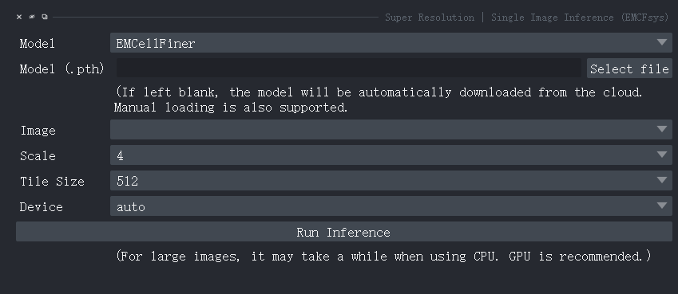

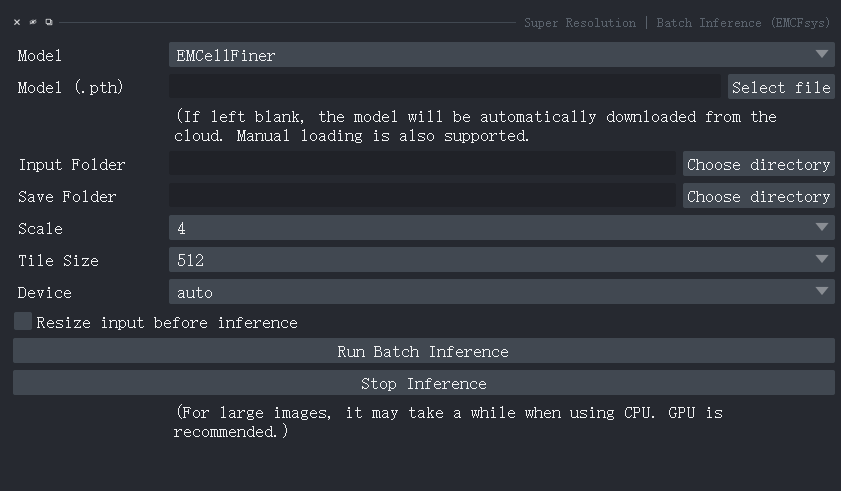

EMCellFiner 用于单张或文件夹图像的超分辨率重建，当前 GUI 的 `Model` 选择为 `EMCellFiner`，支持 scale `1`、`2`、`4`。

推荐使用scale参数为4，以获得最优效果。

如果效果不佳或图像过大导致推理慢，可以先使用Resize工具，将原图缩小为2倍或4倍。

模型路径可以选择本地 `.pth` 权重；留空时插件会从云端自动下载默认权重，手工指定本地权重同样受支持，手动下载路径见[EMCellFincer download Link](https://github.com/yzy0102/emcfsys/releases/latest/download/EMCellFiner.pth)。

### 14.1 Single Image Inference

选择模型、Image 图层、Device、Scale 和 Tile Size，点击 `Run Inference`。结果加入为 `<image_name>_EMCFiner_SR` 新图层。单张界面的 `Tile Size` 可选 `256`、`384`、`512`、`640`；大图建议使用 tile 推理来控制显存。tile 太大可能导致显存不足，太小则会增加边缘拼接开销。

### 14.2 Batch Inference

选择模型、输入文件夹、保存文件夹、scale、tile size 和 device，点击 `Run Batch Inference`。批量界面支持 `256`、`384`、`512`、`640`、`1024` 等 tile size。可选 `Resize input before inference`，勾选后显示 resize factor 和插值算法，适合先降低超大输入的计算量。批量任务在后台线程中运行，并逐个记录已保存文件；可以点击 `Stop Inference` 请求停止。

如果 scale=2 或 scale=4 报尺寸错误，首先确认输入是 2D 图像、scale 字段是单个整数，并使用最新版本的 EMCellFiner 任务代码。不要把四维输出尺寸元组传给 2D `torch.nn.functional.interpolate`。

## 15. Analysis | Phenotype Analysis

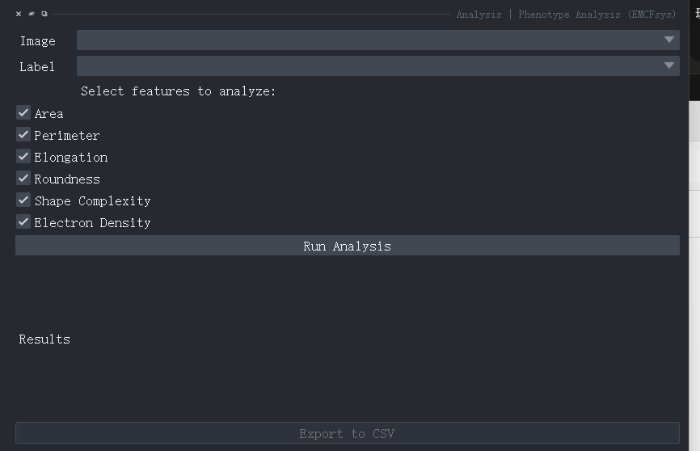

Phenotype Analysis 需要 viewer 中已有一个图像层和一个实例 Labels 层。选择需要计算的特征后点击 `Run Analysis`。

### 15.1 输入和特征

可选特征包括：

- Area：实例面积；
- Perimeter：轮廓周长；
- Elongation：延展程度；
- Roundness：圆度；
- Shape Complexity：形状复杂度；
- Electron Density：实例区域内图像强度/电子密度统计。

分析会生成独立的实例 Labels 图层，并把特征写入图层的 `features`。结果表中每一行对应一个实例，点击某行可以选中对应实例并把 napari 视图移动到其质心。`Export to CSV` 将当前结果导出为 CSV。

界面中的六个特征默认均勾选。分析前应确保 `Label` 是实例标签图层，即每个独立对象拥有不同的正整数 ID；若输入的是只有类别 ID 的语义 mask，同类相连区域不会自动拆分为独立对象。完成分析后 `Export to CSV` 按钮才会启用。

## 16. Hugging Face 数据集示例

仓库中的 `demo_notebook.ipynb` 提供从 Hugging Face 下载语义分割数据、解压 zip、读取 `image`、`label` 和 `splits`，并调用训练和推理可视化的示例。数据下载后必须先解压，再把解压目录中的 `image`、`label`、`splits` 传给训练接口；如果使用 split 文件，严格使用 `train.txt`、`val.txt` 和 `test.txt`。

推荐的数据结构：

```text
PlantSemanticSegTask/
├── image/
├── label/
└── splits/
    ├── train.txt
    ├── val.txt
    └── test.txt
```

Notebook 示例中的 `NUM_CLASSES` 应根据 mask 的最大类别 ID 加 1 计算，并检查类别值是否连续、是否包含背景。

## 17. 常见问题排查

### 推理结果全黑或没有目标

检查 checkpoint 是否与任务匹配；确认 backbone、model、类别数、输入尺寸和归一化配置；确认图像不是全零或 dtype/通道顺序错误。实例分割还要检查 score、NMS IoU 和 mask threshold。

### 验证没有执行

确认验证路径或 `val.txt` 已填写；若使用自动 split，确认 `val split` 大于 0；检查验证集没有被过滤为空。空的验证集和测试集按设计不会执行对应评估。

### LabelMe 转换报错或输出为空

检查 JSON 的 `imagePath` 是否能从 JSON 目录解析，或确认 `imageData` 存在；检查所有 shape 的 label 是否出现在 label map；先运行 `Check LabelMe Folder` 和 `Preview Random Sample`，再开始转换。

### 配置加载后参数不正确

确认配置文件来自同一个任务和同一个模型；检查配置中的路径是否仍然存在。推荐把 checkpoint、`config.json`、`metrics.json` 和日志放在同一训练结果目录，再由 Model Manager 扫描注册。

## 18. 推荐工作流

1. 使用 LabelMe 完成标注。
2. 用对应 LabelMe Converter 转换数据。
3. 用 Dataset Validator 检查数量、尺寸、类别和路径。
4. 在训练界面选择 preset，必要时配置 loss、增强和 split。
5. 保存 config 后启动训练，观察输出日志和验证指标。
6. 用 Model Manager 扫描并注册训练结果。
7. 从 Model Manager 一键打开对应推理界面。
8. 对单张图像或测试集进行推理并保存结果。
9. 对实例 Labels 使用 Phenotype Analysis 导出 CSV。

## 19. 版本和实现参考

插件菜单注册以 [`src/emcfsys/napari.yaml`](../src/emcfsys/napari.yaml) 为准。训练、推理、数据验证和转换的实现位于 [`src/emcfsys/_widget.py`](../src/emcfsys/_widget.py) 以及 [`src/emcfsys/utils`](../src/emcfsys/utils)。Hugging Face 数据集训练示例见 [`demo_notebook.ipynb`](../demo_notebook.ipynb)。

当 GUI 标签与本文档不一致时，以当前插件界面和保存的 `config.json` 为准；配置文件是复现实验参数的最终记录。

## 20.如若遇见问题和Bug，请邮件联系：zeyu_yu@zju.edu.cn
