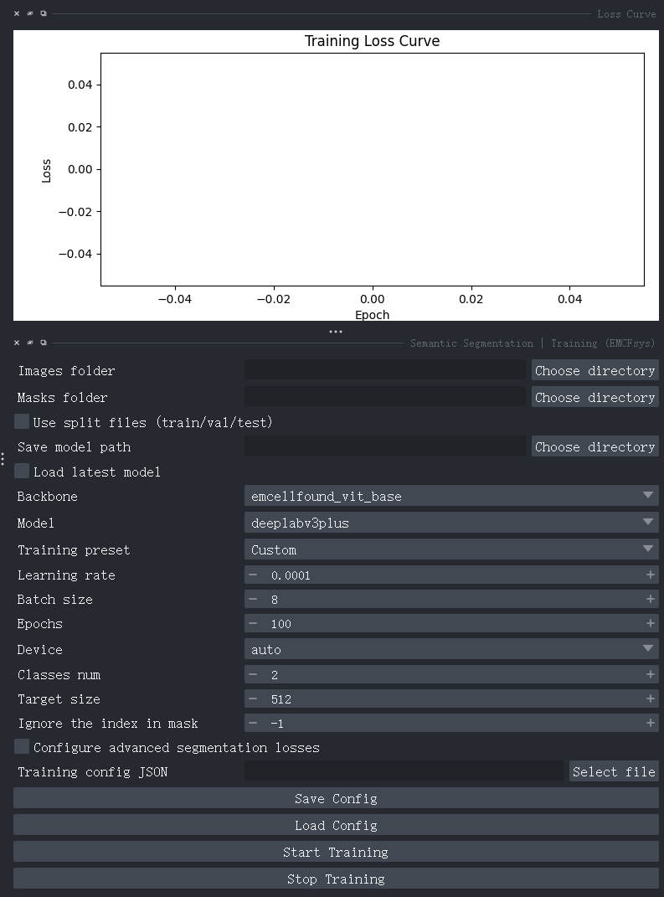

# EMCFsys User Guide

> EMCFsys is a napari plugin for electron microscopy images. It provides image preprocessing, super-resolution, classification, semantic segmentation, instance segmentation, dataset conversion, dataset validation, model management, and phenotype analysis.

## 1. Installation and Startup

Start napari in the configured environment:

Refer to the official napari documentation for installation: [https://github.com/napari/napari](https://github.com/napari/napari) or [napari.org/stable/index.html](https://napari.org/stable/index.html).

You can also follow [ReadMe.md](../README.md) to configure the environment and install napari and the emcfsys plugin.

After installation, open napari's `Plugins` menu and install the emcfsys plugin. Users in mainland China may need a VPN to download the plugin.


The emcfsys plugin will then be available:


After installation, open the napari `Plugins` menu. The available tools are listed in the `EMCFsys` group. Functions are grouped by module so that they remain easy to locate as the plugin grows.


### 1.1 Feature Menu

| Menu group            | Feature                                              | Purpose                                                          |
| --------------------- | ---------------------------------------------------- | ---------------------------------------------------------------- |
| Utility               | Image Resize                                         | Resize an image and create a new napari layer                    |
| Model Manager         | Registry                                             | Persistently manage training results and models                  |
| Semantic Segmentation | Training / Inference                                 | Train and run single-image, sliding-window, or folder inference  |
| Classification        | Training / Inference                                 | Train and predict image classes                                  |
| Instance Segmentation | Training / Inference                                 | Train and predict COCO instance segmentation                     |
| Dataset Tools         | Dataset Validator                                    | Check semantic, instance, and classification datasets            |
| Super Resolution      | Single / Batch Inference                             | Run single-image or batch EMCellFiner super-resolution           |
| Dataset Converter     | LabelMe to Semantic Masks / LabelMe to COCO Instance | Convert LabelMe annotations into training data                   |
| Analysis              | Phenotype Analysis                                   | Measure morphology and intensity features from images and labels |

## 2. General Usage Rules

### 2.1 Default Models and Dataset Demo

Models normally load their weights from the cloud. For example, when the EMCellFound or EMCellFiner model path is empty, the plugin automatically downloads and loads the weights from the GitHub release in the background. The first download may take some time. If loading fails, check the network connection. You can also select a local model path manually for EMCellFiner and EMCellFound (MAE or DINOv3).

If a model cannot be downloaded or loaded, download it manually and place the `.pth` file in the project's `models/` directory. At runtime, the plugin checks this local directory before attempting a cloud download.

Like:


For testing and usage examples, see [demo_notebook.ipynb](../demo_notebook.ipynb).

Datasets for demo_notebook can download into in the project's `datasets/` directory (create it first).

### 2.2 Image and Label Shapes

- 2D electron microscopy images are normally represented as `H x W` arrays. The inference models support 2D images loaded by napari.
- RGB/RGBA images can use the `H x W x C` layout. The inference pipeline converts the image format automatically.
- A semantic segmentation mask must be a single-channel class-ID image. Do not use a color preview as a training label, except for palette PNG files whose underlying data are still single-channel class IDs. Image and mask base names must match. By default, images use the `.tif` extension and labels use `.png`. LabelMe plus the Dataset Converter is recommended for creating semantic segmentation data.
- Prediction results are normally added to napari as new `Image` or `Labels` layers and do not overwrite the original layer.
- The `Image size`, number of classes, backbone, and head used for training and inference must match the model configuration.

### 2.3 Paths and File Names

Image and annotation files in a training dataset should use the same base name whenever possible:

```text
image/cell_001.tif
label/cell_001.png
```

Avoid unauthorized network drives, temporary disks, and excessively long paths. Save the model, configuration, and logs in the same training-result folder when possible so that Model Manager can scan them automatically.

### 2.4 Training Result Files

A completed training directory normally contains:

```text
training_result/
├── *.pth or *.pt              # Model weights
├── config.json                # Training configuration
├── training_log.csv           # Training history
└── metrics.json               # Final or validation metrics
```

Model Manager can scan these files and restore their records from the persistent registry when napari is reopened. Removing a registry record does not delete the model files on disk.

### 2.5 Released Models and Example Datasets

EMCellFound (MAE): [MAE_EMCellFoundVit_base_224_inEMCF.pth](https://github.com/yzy0102/emcfsys/releases/download/EMCFsys/MAE_EMCellFoundVit_base_224_inEMCF.pth)

EMCellFound (DINOv3): [DinoV3_EMCellFound_ViT_base.pth](https://github.com/yzy0102/emcfsys/releases/download/EMCFsys/DinoV3_EMCellFound_ViT_base.pth)

EMCellFiner: [EMCellFiner.pth](https://github.com/yzy0102/emcfsys/releases/download/EMCFsys/EMCellFiner.pth)

Eight-organelle classification dataset: [huggingface.co/datasets/Zeyu0102/EightOrganelleClassification](https://huggingface.co/datasets/Zeyu0102/EightOrganelleClassification)

Plant organelle semantic segmentation dataset: [huggingface.co/datasets/Zeyu0102/EMCF_PlantSegDataset](https://huggingface.co/datasets/Zeyu0102/EMCF_PlantSegDataset)

Liver-6 3D reconstruction dataset: [huggingface.co/datasets/Zeyu0102/liverdataset](https://huggingface.co/datasets/Zeyu0102/liverdataset)

Mitochondria instance segmentation dataset: [huggingface.co/datasets/Zeyu0102/EMCFsys_MitoInstanceSegDataset](https://huggingface.co/datasets/Zeyu0102/EMCFsys_MitoInstanceSegDataset)

More datasets can be requested from the authors at zeyu_yu@zju.edu.cn.

## 3. Utility | Image Resize


Image Resize creates a new napari image layer at a specified size or scale factor. It is useful for standardizing model inputs before inference and for quickly preparing images.

### 3.1 Parameter Reference

| Control               | Description                                                                  |
| --------------------- | ---------------------------------------------------------------------------- |
| Image                 | Select an image layer from the current viewer                                |
| Resize Mode           | `Absolute Size` uses width and height; `Scale Factor` uses scale factors |
| Width / Height        | Target width and height in absolute-size mode                                |
| Scale X / Scale Y     | Horizontal and vertical scale factors in scale mode                          |
| Maintain Aspect Ratio | Preserve the aspect ratio to avoid stretching                                |
| Algorithm             | Nearest-neighbor, bilinear, bicubic, or Lanczos interpolation                |

`Nearest Neighbor` is suitable for class labels or discrete masks. Ordinary grayscale images normally use `Bilinear` or `Bicubic`. Click `Apply Resize!` to create a new layer; the original layer remains unchanged.

## 4. Model Manager | Registry


Model Manager is a persistent model registry and does not require all models to be stored in one folder. It records model names, task types, checkpoint paths, configuration paths, metrics, and notes.

### 4.1 Registry File

The default registry path is:

```text
~/.emcfsys/model_registry.json
```

Set `EMCFSYS_MODEL_REGISTRY` to use another location. Use `Load Registry` to read an existing registry and `Save Registry` to write the current records. The registry is an index file, not a copy of the model weights.

### 4.2 Scan Training Results

1. Select a training-result root in `Training result root`.
2. Click `Scan Folder and Register`.
3. The plugin searches for checkpoints, `config.json`, `metrics.json`, and `training_log.csv`.
4. Scanned results are added to the list and saved to the registry.

If models and training results are stored in multiple directories, scan each directory separately. Scanning does not move or copy the original models.

### 4.3 Manual Registration

Manual registration fields are hidden by default. Check `Manual registration` to show the model name, task type, checkpoint, configuration, metrics, log, and notes fields. Manual registration is useful when:

- weights come from an external training framework;
- weights and configuration are stored in different directories;
- a model needs additional notes or a manually specified task type.

Click `Register / Update` to save the record to the registry. Paths must point to existing files, and the task type must match the downstream inference module.

### 4.4 Model List and One-Click Actions

After selecting a model, you can use:

| Button                       | Action                                                            |
| ---------------------------- | ----------------------------------------------------------------- |
| Refresh List                 | Reload the current registry                                       |
| Show Selected Details        | View complete paths, configuration, metrics, and notes            |
| Open / Fill Inference Widget | Open the matching inference widget and fill model parameters      |
| Open / Fill Training Widget  | Open the matching training widget and fill training configuration |
| Check Selected Model         | Check whether checkpoints, configuration, and logs exist          |
| Open Model Folder            | Open the model directory in the file manager                      |
| Delete from Registry         | Delete only the registry record, not the files                    |
| Rename selected / Edit notes | Change the display name and notes                                 |
| Import / Export Registry     | Import or export a registry JSON file                             |

When napari is reopened, model records can be restored as long as the registry JSON still exists and the paths have not changed. If a model has been moved, use `Check Selected Model` to identify missing files, then correct the paths through manual registration or by importing an updated registry.

## 5. Semantic Segmentation | Training



Semantic segmentation predicts a class ID for every pixel. It is suitable for non-overlapping categories such as background, organelles, or tissue regions.

### 5.1 Dataset Directory

When split files are not used, the recommended layout is:

```text
semantic_dataset/
├── images/
│   ├── sample_001.tif
│   └── sample_002.tif
└── masks/
    ├── sample_001.png
    └── sample_002.png
```

Select `images` in `Images folder` and `masks` in `Masks folder`. Image and mask base names must match. Pixel values in the mask are class IDs, with background usually represented by 0. The folder names are not mandatory as long as the two fields point to the correct image and single-channel mask directories.

### 5.2 Split Files

Check `Use split files (train/val/test)` to show the three path fields. The files must be in the same `splits` directory and use these exact names:

```text
splits/
├── train.txt
├── val.txt
└── test.txt
```

Each line contains an image stem or relative file name without the image extension, for example `sample_001`. `train.txt` and `val.txt` are used for training and validation. `test.txt` is recorded for later inference or testing and is not used for training. When the option is unchecked, the existing behavior is preserved and the training workflow creates a split according to the validation ratio.

### 5.3 Model and Training Parameters

| Control           | Recommendation                                                                                                                                                  |
| ----------------- | --------------------------------------------------------------------------------------------------------------------------------------------------------------- |
| Load latest model | Optional complete segmentation model for resuming model training. Note that this is not the EMCellFound backbone weights, but a full complete model checkpoint. |
| Backbone          | Choose according to available memory and dataset size; pretrained weights must match the backbone. (All backbone are pretrianed from EMCFsys or ImageNet22K\1K) |
| Model             | Segment heads:`deeplabv3plus`, `unet`, `pspnet`, `upernet`, `mask2former`, and others                                                                 |
| Classes num       | Total number of classes including background (1 + the number of foreground classes)                                                                             |
| Target size       | Model input size;`512 x 512` is recommended                                                                                                                   |
| Batch size        | Reduce this value first when GPU memory is insufficient                                                                                                         |
| Learning rate     | Start with a smaller value for small datasets; EMCFsys uses a conservative default for fine-tuning                                                              |
| Ignore index      | Pixel ID excluded from loss and metric calculations                                                                                                             |
| Device            | `auto`, `cpu`, or `cuda`                                                                                                                                  |

`Training preset` provides quick parameter templates: `Custom`, `Balanced Default`, `Fast Debug`, `Small Organelle`, `Boundary Sensitive`, and `Class Imbalance`. A preset updates the learning rate, batch size, epochs, image size, and loss weights. Switch to `Custom` for individual adjustments.

### 5.4 Loss Configuration

When `Configure advanced segmentation losses` is unchecked, the standard cross-entropy loss is used. When checked, the following six auxiliary loss weights can be configured:

- Dice loss: improves foreground overlap;
- Focal loss: emphasizes difficult pixels and class imbalance;
- Tversky loss: adjusts the preference between false negatives and false positives;
- Boundary loss: emphasizes object boundaries;
- Lovasz-Softmax: directly improves IoU-related ranking;
- OHEM CE: prioritizes difficult pixels.

Cross entropy remains the base loss during training. The checkbox controls whether the advanced combination terms are enabled, and larger weights give the corresponding term more influence. Dice plus Boundary is useful for small objects or blurry boundaries. Focal or Tversky can be tried when the foreground occupies only a small fraction of the image. Avoid setting every weight high at once; first observe validation metrics and the loss curve.

### 5.5 Mask2Former-Specific Options

The GUI shows matching-point settings only when `Model` is set to `mask2former`. The option controls point sampling for query matching and supports random or uncertainty sampling. Uncertainty sampling focuses computation on uncertain regions and reduces the cost of high-resolution mask matching. This control is hidden for ordinary DeepLab or UNet models.

### 5.6 Save Configuration and Train

1. Set the dataset paths, model, number of classes, and training parameters.
2. To reproduce an experiment, enter a path in `Training config JSON` and click `Save Config`.
3. Click `Start Training`.
4. Logs appear in the training output dock. When training finishes, the model, configuration, CSV log, and metric files are generated.
5. Use `Stop Training` to request a background-thread stop. Completed files are not deleted.

Training logs report the average loss and overall training/validation metrics for each epoch. They also print a per-class table containing Val Acc, Precision, Recall, F1, Dice, and IoU. Values are displayed with four decimal places. If no validation set is available, validation is skipped so that missing results are not mistaken for model performance. By default, the checkpoint with the best validation mIoU is saved.

## 6. Semantic Segmentation | Inference


### 6.1 Single-Image Inference

1. Select a model file in `Model (.pt/.pth/.ptscript)`.
2. Select the current napari `Image` layer.
3. Set `Backbone`, `Model`, `num classes`, `Device`, and `Image size to model`.
4. Click `Run Full Inference`.

The result is added to the viewer as a new labels layer. The model configuration and inference parameters must match, especially the model type, backbone, and number of classes.

### 6.2 Sliding-Window Inference

For very large microscopy images, set `Slide window size` and click `Run Slide Inference`. Sliding-window inference divides the image into tiles, runs the model on each tile, and merges the predictions. It usually preserves small objects better than resizing the entire image. Larger windows use more GPU memory; overlap and edge handling are managed by the inference task.

### 6.3 Folder Inference

Check `Inference from folder` and select the image and output directories. The following outputs can be saved separately:

- raw class masks: `*_mask.png`;
- palette visualization: `*_mask_viz.png`;
- image and mask overlay: `*_mask_stack.png`.

Uncheck `Save visualization mask` or `Save stacked image + visualization` to reduce the number of output files. Folder inference also runs in a background thread and updates the log when it finishes or stops.

## 7. Classification | Training


Classification outputs one class for each image. It is suitable for organelle patches or other images that have already been cropped into individual objects.

### 7.1 Dataset Directory

Use existing `train` and `val` subdirectories when possible:

```text
classification_dataset/
├── train/
│   ├── Mitochondria/***.png
│   └── Nucleus/***.png
└── val/
    ├── Mitochondria/***.png
    └── Nucleus/***.png
```

If `train/val` is not available, select the root directory containing class subdirectories. The plugin creates a stratified split according to `Validation split`. The default split seed is 42. Fixed data and parameters should produce reproducible results, although external random augmentation or changes to the files can still change the result.

### 7.2 Backbone, Head, and Parameters

- `Backbone`: select the feature extraction network;
- `Head=knn`: extract features and build a KNN memory bank without end-to-end backpropagation;
- `Head=linear`: train a linear classification head on the extracted features;
- `Use pretrained backbone`: use pretrained features;
- `Freeze backbone for linear head`: freeze the backbone and train only the classification head;
- `KNN K` and `KNN metric`: set the number of neighbors and cosine/L2 distance;
- `Resume checkpoint`: continue from an existing classification checkpoint.

KNN is useful for quickly checking whether the features separate the classes. For repeated runs, fix the data split, random seed, pretrained weights, and KNN parameters. Also make sure validation images have not been placed in the training directory.

### 7.3 Training Output

Classification training saves the configuration, log, metrics, and checkpoint. KNN mainly reports validation accuracy; the linear classifier normally reports both training and validation accuracy. Use `Stop Training` to stop the training task without blocking the napari main window.


## 8. Classification | Inference

Select a `.pth` checkpoint generated by training and choose a `Device` to classify the current Image layer. This interface only requires a checkpoint. The network structure, class names, image size, and classification head are restored from checkpoint metadata, so training parameters do not need to be entered again.

| Control               | Usage                                                                           |
| --------------------- | ------------------------------------------------------------------------------- |
| Checkpoint (.pth)     | Select a KNN or linear-classification checkpoint                                |
| Image                 | Select the napari image layer for single-image mode                             |
| Device                | `auto` prefers CUDA; `cpu` or `cuda` can also be selected explicitly      |
| Inference from folder | Switch to folder prediction and hide the single-image selector                  |
| Image folder          | Input image directory, shown only in folder mode                                |
| Output CSV            | Output path for batch prediction results, shown only in folder mode             |
| Run Classification    | Run prediction in a background thread and write to Classification Inference Log |

Single-image logs show `class_name`, class index, and four-decimal confidence. In folder mode, select the image directory and `Output CSV`; the plugin writes `path`, `class_index`, `class_name`, and `confidence` for each image.

Model Manager's `Open / Fill Inference Widget` can automatically fill the checkpoint, backbone, head, number of classes, and device in the classification inference widget.

## 9. Instance Segmentation | Training


Instance segmentation predicts the class, bounding box, and independent mask for each object. It is suitable when organelles touch one another or objects of the same class must be counted separately.

### 9.1 COCO Data Input

Training requires an image directory and a COCO instances JSON file:

```text
coco_dataset/
├── images/
│   ├── sample_001.tif
│   └── sample_002.tif
└── train.json
```

The JSON stores `images`, `annotations`, and `categories`. Image files are referenced by the JSON `file_name`; image data are normally not embedded directly in the JSON. Each `file_name` must resolve to a file under `COCO images folder`.

### 9.2 Training and Validation Settings

Fill in `COCO images folder`, `COCO instances JSON`, the save directory, backbone, model, image size, number of classes, batch size, epochs, learning rate, and device.

- When `num classes=0`, the number of classes is inferred from COCO categories. A custom value must match the JSON.
- If `val split > 0` and no separate validation set is specified, the training workflow splits validation data from the total JSON.
- Check `Use separate val/test datasets` to enter separate validation and test image directories and annotation JSON files.
- If validation or test paths are empty, the corresponding evaluation is skipped.

The fields can be filled in the following groups:

| Group           | Key controls                                                         | Description                                                        |
| --------------- | -------------------------------------------------------------------- | ------------------------------------------------------------------ |
| Data            | COCO images folder / COCO instances JSON                             | Required; JSON`file_name` must resolve under the image directory |
| Save            | Save model folder                                                    | Stores the checkpoint,`config.json`, `metrics.json`, and logs  |
| Model           | Backbone / Model / Image size / Num classes                          | Must match inference;`0` means infer from COCO                   |
| Optimizer       | Training preset / Batch size / Epochs / Learning rate / Weight decay | Presets provide recommendations;`Custom` allows adjustments      |
| Validation      | Validation split / Use separate val/test datasets                    | Choose an internal split or separate COCO validation/test data     |
| Resume          | Use pretrained backbone / Resume checkpoint                          | Load a pretrained backbone or continue an existing run             |
| Reproducibility | Training config JSON / Save Config / Load Config                     | Save and load the current GUI training parameters                  |

Click `Start Instance Seg Training` to start background training. The loss curve appears in the `Instance Segmentation Loss Curve` dock, and runtime logs appear in the training log dock. `Stop Training` requests a stop while preserving completed epochs, models, and logs.

### 9.3 Instance Segmentation Augmentation

`Configure data augmentation` controls instance-segmentation-specific augmentation. The default general pipeline includes:

- random horizontal flip;
- random vertical flip;
- random 90-degree rotation;
- random brightness and contrast perturbation;
- random Gaussian noise;
- random cropping with synchronized bbox and mask cropping;
- configurable Mosaic, MixUp, HSV perturbation, and padding.

Augmentation probabilities and magnitudes should be chosen according to the microscopy data. Rotations and flips change spatial orientation, so they must be applied to the image, masks, and bounding boxes together. Strong brightness or contrast perturbation should not destroy the basic separability between objects and background.

The default general augmentation shown in the screenshot uses horizontal flip `0.50`, vertical flip `0.50`, 90-degree rotation `0.50`, brightness and contrast perturbation `0.15`, random crop probability `0.30`, minimum crop scale `0.70`, Mosaic `1.00`, MixUp `0.50`, HSV hue/saturation/value deltas `5/30/30`, and padding value `114`. The default Gaussian noise standard deviation is `0.00`, so no noise is added. If the dataset is small and object orientation has biological meaning, disable unsuitable flips or rotations before comparing validation metrics.

### 9.4 Instance Segmentation Loss

Check `Configure advanced mask losses` to set weights for Boundary mask loss, Focal mask loss, and Tversky mask loss. These are auxiliary terms for mask prediction: increase Boundary for blurry boundaries, try Focal for very small foreground regions or class imbalance, and try Tversky when missed detections are especially costly.

### 9.5 Models and Evaluation

The instance segmentation head supports registered models such as `rtm_instance` and `mask2former_instance`. Matching points are shown only when Mask2Former is selected; point sampling reduces the cost of high-resolution query matching.

Validation and test stages can report COCO-style mAP, AP50, and AP75, as well as mask IoU, box IoU, precision, and recall. If training runs out of GPU memory, first reduce the batch size, image size, or number of matching points before reducing the backbone.

## 10. Instance Segmentation | Inference


Select the checkpoint, backbone, model, image size, number of classes, score threshold, NMS IoU, mask threshold, maximum detections, and device, then click `Run Instance Segmentation`.

| Control                  | Description                                                                              |
| ------------------------ | ---------------------------------------------------------------------------------------- |
| Checkpoint (.pth)        | Instance segmentation checkpoint generated by training                                   |
| Image                    | napari image layer in single-image mode                                                  |
| Backbone / Model         | Must match the checkpoint architecture                                                   |
| Image size / Num classes | Must match the training configuration                                                    |
| Score threshold          | Filters low-confidence boxes; a lower value increases recall but may add false positives |
| NMS IoU                  | Deduplication threshold for overlapping candidate boxes                                  |
| Mask threshold           | Threshold used to binarize probability masks                                             |
| Max detections           | Maximum number of instances retained per image                                           |
| Device                   | `auto`, `cpu`, or `cuda`                                                           |
| Output CSV               | Saves a summary of each instance in either mode                                          |

In single-image mode, the current Image layer is read and a separate Labels layer is created for each instance. The layer name is usually `<image_name>_instances`. The output boxes and instance count are written to the log.

Check `Inference from folder` to select:

- an input image folder;
- an output CSV file;
- an instance-mask output folder;
- a binary-mask output folder.

Folder mode writes an instance summary for every image. When `Instance mask output folder` is set, a full-image instance-ID mask is saved. When `Binary masks output folder` is set, a binary mask is saved for each instance. The Image selector is hidden in folder mode. If no instances are detected, first confirm that the checkpoint, number of classes, and image preprocessing match training, then consider lowering the score or mask threshold. Do not use a semantic segmentation checkpoint for instance segmentation inference.

## 11. Dataset Tools | Dataset Validator


Dataset Validator is the unified dataset-checking entry point for `semantic_segmentation`, `instance_segmentation`, and `classification` tasks.

First select a `Task`. Only the required fields are shown for each task: semantic segmentation shows `Images folder` and `Masks folder`; instance segmentation shows `Images folder` and `COCO annotation JSON`; classification shows `Classification dataset folder`. `Preview index (-1=random)` selects the sample to preview, and `Export report JSON` sets the validation-report path.

### 11.1 Semantic Segmentation Checks

Select `Images folder` and `Masks folder`, then click `Check Dataset`. The tool checks image-mask pairing, matching dimensions, and recognizable mask class IDs. It summarizes file counts, class values, missing files, and invalid files.

### 11.2 Instance Segmentation Checks

Select `Images folder` and the COCO annotation JSON. The tool checks the JSON structure, image-file existence, and the validity of annotation `bbox`, `segmentation`, `area`, and `category_id` fields. It reports empty annotations, out-of-bounds boxes, and invalid polygons.

### 11.3 Classification Checks

Select the classification dataset root. The tool counts class directories and images, checks for empty class directories, and previews samples according to `Preview count`.

### 11.4 Preview and Report

- `Preview index=-1` selects a random sample; a non-negative index provides a reproducible sample.
- Semantic segmentation preview adds the image and labels to the viewer.
- Instance segmentation preview overlays instance labels and yellow bounding boxes.
- Classification preview displays samples in a grid while preserving class information.
- `Export Report` writes a JSON report that can be archived or shared before training.

## 12. Dataset Converter | LabelMe to Semantic Masks


The LabelMe semantic annotation converter turns a folder of JSON files into a trainable semantic segmentation dataset.

### 12.1 LabelMe Annotation Requirements

In LabelMe, draw a polygon for each object or region and use a consistent label name for each class. A JSON file may embed the image through `imageData` or reference an external image through `imagePath`. External image paths must be resolvable relative to the JSON directory.

### 12.2 Conversion Workflow

1. Select `LabelMe JSON folder` and the output dataset directory.
2. Click `Infer Label Map` to collect class names automatically.
3. Check `label_name`, `class_id`, and `color` in the label map. Use `Load Label Map JSON` or `Save Label Map JSON` when needed.
4. Set `Background ID`, `Ignore ID`, and the behavior for unlabeled pixels.
5. Click `Check LabelMe Folder` to validate the JSON files, images, and shapes.
6. Use `Preview Random Sample` to inspect the image, mask, and visualization.
7. To split the data, check the split option and enter the train/val/test ratios and seed.
8. Select the desired outputs: single-channel class masks, RGB color masks, label visualizations, and overlay previews.
9. Click `Convert LabelMe to Semantic Dataset`.

Conversion runs in a background thread and writes progress to the output box, so napari remains responsive. Clicking `Cancel Conversion` stops after the current JSON has finished. The output directory normally contains `images/`, `masks/`, optional `rgb_masks/`, visualization directories, and optional `splits/train.txt`, `val.txt`, and `test.txt`. The main training inputs are `images/*.tif` and `masks/*.png`; select these two directories in the semantic segmentation training widget.

## 13. Dataset Converter | LabelMe to COCO Instance


This converter transforms LabelMe annotations in which each object is represented by one polygon into a COCO instance segmentation JSON file.

### 13.1 Parameters

| Control                      | Description                                                                                |
| ---------------------------- | ------------------------------------------------------------------------------------------ |
| LabelMe JSON folder          | Directory containing LabelMe JSON files                                                    |
| Output COCO JSON             | Main COCO JSON output path                                                                 |
| Copy images to output folder | Whether to copy associated images to the output directory                                  |
| Output image folder          | Destination for copied images; if empty, an`images` directory is created beside the JSON |
| Split train/val/test JSONs   | Whether to generate three COCO JSON files                                                  |
| Train/Val/Test ratio         | Split ratios used when splitting is enabled                                                |
| Split seed                   | Fixed random seed for splitting; default is 42                                             |
| Category order               | One class name per line or comma-separated; empty means infer from the JSON files          |

After conversion, set `COCO images folder` to the output image directory and `COCO instances JSON` to the generated JSON in the instance segmentation training widget. The converter also provides `Cancel Conversion`, and progress is shown in its dedicated output box.

When `Copy images to output folder` is checked, `Output image folder` must be set. If it is empty, the plugin creates an `images/` directory beside the main COCO JSON. When `Split train/val/test JSONs` is checked, `train.json`, `val.json`, and `test.json` are generated beside the main JSON, with ratio and seed fields shown in the interface. `Category order` can contain one class per line or comma-separated names and is used to fix the category-ID order; when empty, labels are inferred from the JSON files.

## 14. Super Resolution | EMCellFiner


EMCellFiner performs single-image or folder-based super-resolution reconstruction. The current GUI `Model` selection is `EMCellFiner`, with supported scales `1`, `2`, and `4`.

Scale `4` is recommended for the best results.

If the result is unsatisfactory or the image is too large for efficient inference, use Image Resize first to reduce the original image by a factor of 2 or 4.

You can select a local `.pth` model. If the field is empty, the plugin downloads the default weight from the cloud. Manual loading is also supported; see the [EMCellFiner download link](https://github.com/yzy0102/emcfsys/releases/latest/download/EMCellFiner.pth).

### 14.1 Single-Image Inference

Select the model, Image layer, Device, Scale, and Tile Size, then click `Run Inference`. The result is added as a new layer named `<image_name>_EMCFiner_SR`. The single-image interface supports tile sizes `256`, `384`, `512`, and `640`; tiling is recommended for large images to control GPU memory. A tile that is too large may cause out-of-memory errors, while a tile that is too small increases edge-stitching overhead.

### 14.2 Batch Inference

Select the model, input folder, save folder, scale, tile size, and device, then click `Run Batch Inference`. The batch interface supports tile sizes `256`, `384`, `512`, `640`, and `1024`. `Resize input before inference` can be enabled to show a resize factor and interpolation algorithm, which is useful for reducing the cost of very large inputs. Batch tasks run in a background thread and log each saved file; click `Stop Inference` to request a stop.

If scale 2 or scale 4 produces a size error, first confirm that the input is a 2D image, the scale field is a single integer, and the latest EMCellFiner task code is installed. Do not pass a four-dimensional output-size tuple to 2D `torch.nn.functional.interpolate`.

## 15. Analysis | Phenotype Analysis


Phenotype Analysis requires an image layer and an instance Labels layer in the viewer. Select the features to calculate and click `Run Analysis`.

### 15.1 Inputs and Features

Available features include:

- Area: instance area;
- Perimeter: contour perimeter;
- Elongation: degree of elongation;
- Roundness: roundness;
- Shape Complexity: shape complexity;
- Electron Density: image intensity or electron-density statistics inside the instance region.

The analysis creates an independent instance Labels layer and stores the features in the layer's `features` table. Each result-table row corresponds to one instance. Clicking a row selects the corresponding instance and moves the napari view to its centroid. `Export to CSV` exports the current results as a CSV file.

All six features are checked by default. Before analysis, make sure `Label` is an instance label layer in which each independent object has a different positive integer ID. A semantic mask containing only class IDs will not automatically split connected regions of the same class into independent objects. `Export to CSV` becomes enabled after analysis is complete.

## 16. Hugging Face Dataset Example

The repository's `demo_notebook.ipynb` includes an example that downloads a semantic segmentation dataset from Hugging Face, extracts the ZIP archive, reads `image`, `label`, and `splits`, and calls the training and inference-visualization functions. The downloaded data must be extracted before the `image`, `label`, and `splits` directories are passed to the training interface. When split files are used, the code strictly uses `train.txt`, `val.txt`, and `test.txt`.

The recommended structure is:

```text
PlantSemanticSegTask/
├── image/
├── label/
└── splits/
    ├── train.txt
    ├── val.txt
    └── test.txt
```

In the notebook example, calculate `NUM_CLASSES` as the maximum mask class ID plus one. Also check whether class values are continuous and whether the background class is present.

## 17. Troubleshooting

### Inference Results Are Completely Black or Empty

Check that the checkpoint matches the task. Confirm the backbone, model, number of classes, input size, and normalization configuration. Make sure the image is not all zero and that its dtype and channel order are correct. For instance segmentation, also check the score, NMS IoU, and mask thresholds.

### Validation Did Not Run

Confirm that a validation path or `val.txt` has been provided. If automatic splitting is used, confirm that `val split` is greater than 0, and check that the validation set was not filtered to an empty set. Empty validation and test sets are intentionally skipped.

### LabelMe Conversion Fails or Produces Empty Output

Check that `imagePath` can be resolved relative to the JSON directory, or confirm that `imageData` is present. Make sure every shape label exists in the label map. Run `Check LabelMe Folder` and `Preview Random Sample` before starting conversion.

### Parameters Are Incorrect After Loading a Configuration

Confirm that the configuration belongs to the same task and model. Check that all paths in the configuration still exist. It is recommended to keep the checkpoint, `config.json`, `metrics.json`, and logs in one training-result directory, then scan and register the directory through Model Manager.

## 18. Recommended Workflow

1. Complete the annotations in LabelMe.
2. Convert the data with the corresponding LabelMe Converter.
3. Use Dataset Validator to check counts, dimensions, classes, and paths.
4. Select a preset in the training widget and configure loss, augmentation, and splits when needed.
5. Save the configuration, start training, and monitor the output log and validation metrics.
6. Scan and register the training result through Model Manager.
7. Open the matching inference widget from Model Manager.
8. Run inference on single images or the test set and save the results.
9. Use Phenotype Analysis on instance Labels to export a CSV file.

## 19. Version and Implementation References

Plugin menu registration is defined in [`src/emcfsys/napari.yaml`](../src/emcfsys/napari.yaml). Training, inference, dataset validation, and conversion are implemented in [`src/emcfsys/_widget.py`](../src/emcfsys/_widget.py) and [`src/emcfsys/utils`](../src/emcfsys/utils). The Hugging Face dataset training example is in [`demo_notebook.ipynb`](../demo_notebook.ipynb).

If a GUI label differs from this document, follow the current plugin interface and the saved `config.json`; the configuration file is the authoritative record for experiment parameters.

## 20. Questions and Bug Reports

For questions or bug reports, please contact: zeyu_yu@zju.edu.cn
