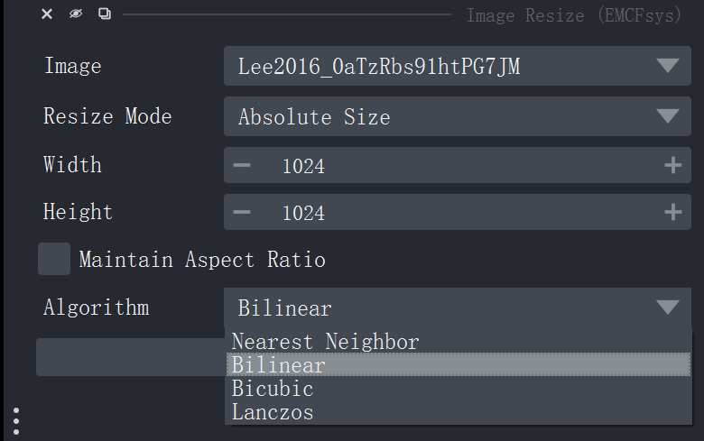
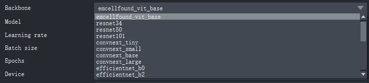
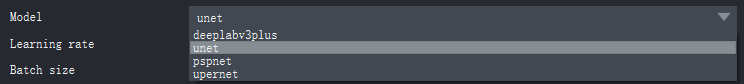
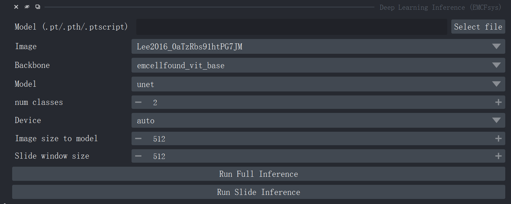
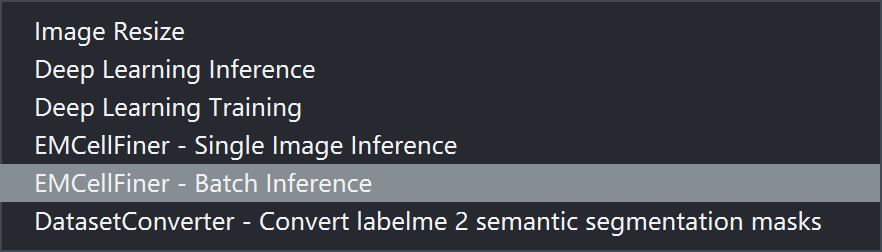
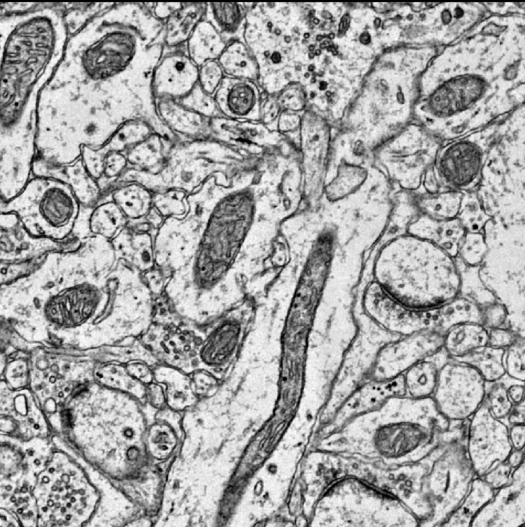
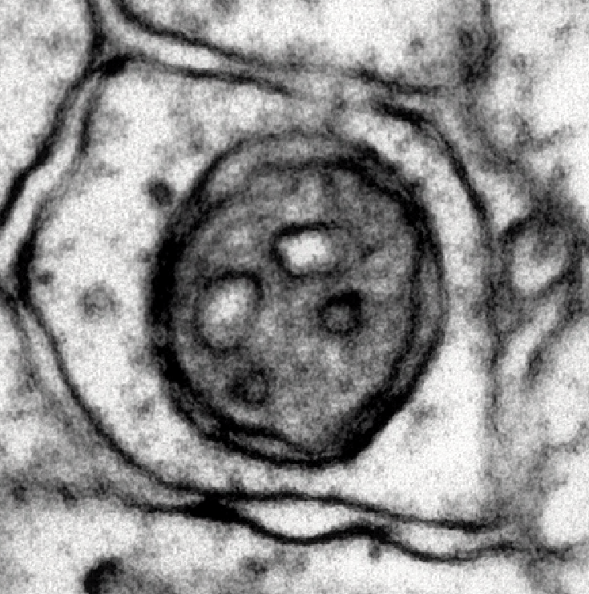
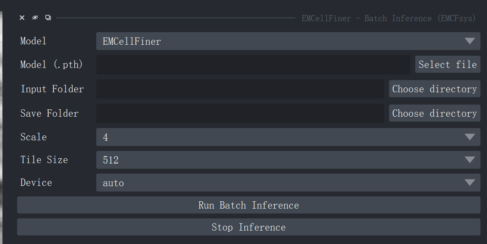
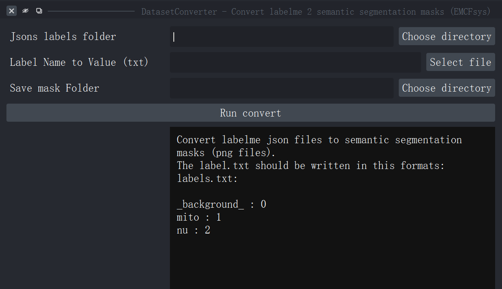

# emcfsys Tutorial 📚

Welcome to **emcfsys** — a foundation model integration framework for Cell EM image analysis designed for the Napari platform.
---

## Contents
1. Introduction  📚
2. Functions for image data processing 🛠️
3. EMCellFiner function 🛠️
4. EMCellFound function 🛠️
5. Dataset conversion function 🛠️


## 1. Introduction 📚

This tutorial demonstrates:
- Introduction to the functions and interface of the emcfsys plugin
- Functions for image data processing
- EMCellFound module integration features, including model deep learning training and inference
- EMCellFiner module integration features, including single image super-resolution inference with EMCellFiner and batch super-resolution inference for multiple images in a folder
- Dataset conversion for segmentation

---

## 2. Prerequisites: Correctly install the napari platform and the emcfsys plugin 🔍
1. Correctly install napari and emcfsys plugin, see [ReadMe Installation](../README.md)
2. Then open napari, you can see the software GUI as follow, and you can check the emcfsys plugin in plugin-store:
   
   And you can find emcfsys plugin.
   

---

## 3. Functions for image data processing（Widget） 🛠️

Provides several image processing components, including:
1. `ImageResize`: interactively resize images

   - Image Resize function: Resize the selected image to any other size
    1. The GUI of the Resize funciton
    2. You can select the resize algorithm, use bilinear by default
    3. Also, you can resize by scale 
    4. Now, it only support single image. Later, **it will support reisze the 3D voxel and 2.5D image stack**.


---

## 4. EMCellFound function  🔬
- Including deep learning model training and inference functions

1. Deep learning training funcion
   This function support to finetune the pretrained ViT backbone "EMCellFound", or other pretrained backbone from timm library including convnext, resnet, efficientNet, ViT and so on.
    
    
   1. Select backbone
   2. Select the segment head, default Unet
   3. Fill the image folder, mask folder and save model path.
   4. Select the parameters, like learning rate, batch size, training epochs, device(cuda\cpu), classes num(including background), target size(the input image size for model training), ignore the index(if 0 will ignore background, -1 by default).
   5. Then click 'Start Training' and check the loss curve.
   6. If the loss stops decreasing, you can click 'Stop Training'.
   7. Now, the model only support semantic segmentation task. In the future, it will support zero shot classification, few shot instance segmentation.

2. Deep Learning model Inference funcion
   In this function, you can use the model to inference.
   
   
   1. When the training step done, Check the save_model path, and find the best IOU model.
   2. Now, load the model.
   3. Check the "Backbone", "Model" and "Image size to model", Ensure it is the **same architecture** used in the previous training.
   4. The "Image size to model" is the image size input to the model. And the Slide window size, is the window size for slide-inference.
   5. If you click "Full Inference", it will perform reasoning on the entire image. And if lick "Slide Inference", it will perform reasoning on each image window by the window size using slide-window mode. "Slide Inference" is suitable for segmenting large images with small objects.

---

## 5. EMCellFiner function 📁
EMCellFiner is the training-free funcion. So, the EMCellFiner model can be **used directly** without the need for training or fine-tuning.

To make it more convenient to use the model, we designed two inference functions.

- One approach is to perform inference on a single image or a small stack of images. See **Single Image Inference**
- Another approach is to perform inference on a large batch of images in a folder. See **Batch Inference**

1. **Single Image Inference**
   In this function, Just load the image and click Run Inference.
   The EMCellFiner model will be automatically downloaded from the cloud. If download failed, you can download the model from [EMCellFincer download Link](https://github.com/yzy0102/emcfsys/releases/latest/download/EMCellFiner.pth) and fill the Model(.pth), the model will be loaded from local.
   
   
   Witness the miracle of super-resolution algorithms!
   Before:
   

   After SR! 
   
    Before:
    
   After SR! 
   
2. **Batch Inference**
   In this function, select local folder where images are saved as single tif/png/jpeg.., and select another local folder to save the Super-Resolution image.
   
   Just click "Run Batch Inference". And SR image will be saved to "Save Folder" one by one.

---
## 6. Dataset converter! 
In this function, you can convert the lableme json files to **Semantic segmentation task** dataset.

1. First, you can label the EM image using labelme software, and it will output json files.
2. Use this function, and select the label folder.
3. Create a .txt file, and write the label information. For example, you label the mito and nu, just write in this way:
    ```
    _background_ : 0
    mito : 1
    nu : 2
    ```
    So, the num classes in this dataset is 3.
    
    If you only label the mito, so write the label.txt like this one:
    ```
    _background_ : 0
    mito : 1
    ```
    The num classes in this dataset is 2.


---

## 7. Example Notebook and Sample Code 📁

- Run `notebooks/tutorial.ipynb` (or `test2.ipynb`) to execute the examples interactively.
- Check the scripts under `examples/` (such as `image_resize_example.py`) for ready-to-run script examples.

---
## 8. Feedback and Contact 💬

For suggestions on improving the tutorial or missing examples, please submit issues or email zeyu_yu@zju.edu.cn. Thank you!

---
## 9.    Have Fun with the emcfsys! 