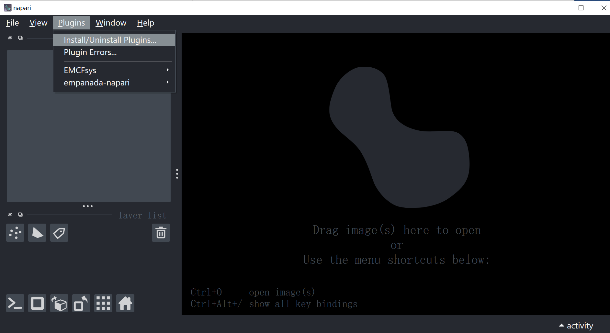
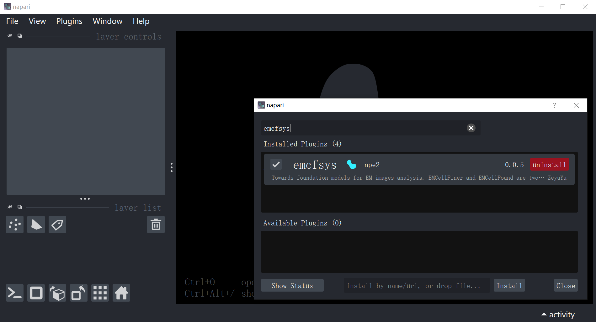

# emcfsys Tutorial 📚

Welcome to **emcfsys** — a foundation model integration framework for Cell EM image analysis designed for the Napari platform.
---

## Contents
1. Introduction  📚
2. Functions for image data processing 🛠️
3. EMCellFiner function 🛠️
4. EMCellFound function 🛠️
5. Dataset conversion function 🛠️


## 1. Introduction 📚

This tutorial demonstrates:
- Introduction to the functions and interface of the emcfsys plugin
- Functions for image data processing
- EMCellFound module integration features, including model deep learning training and inference
- EMCellFiner module integration features, including single image super-resolution inference with EMCellFiner and batch super-resolution inference for multiple images in a folder
- Dataset conversion for segmentation

---

## 2. Prerequisites: Correctly install the napari platform and the emcfsys plugin 🔍
1. Correctly install napari and emcfsys plugin, see [ReadMe Installation](../README.md)
2. Then open napari, you can see the software GUI as follow, and you can check the emcfsys plugin in plugin-store:
   
   And you can find emcfsys plugin.
   

---

## 3. Functions for image data processing（Widget） 🛠️

Provides several image processing components, including:
- `ImageResize`: interactively resize images


---

## 4. EMCellFound function  🔬
- Including deep learning model training and inference functions


```python
from emcfsys.EMCellFound.inference import load_model, infer_full_image
model = load_model(model_name='deeplabv3plus', backbone_name='resnet34', num_classes=2, model_path='path/to/model.pth')
mask = infer_full_image(model, img, input_size=(512,512))
viewer.add_labels(mask, name='pred_mask')
```

- EMCellFiner 用于对检测结果做后处理或精修，请参考 `src/emcfsys/EMCellFiner` 下的示例与 `inference_hat.py`。

---

## 5. EMCellFiner function 📁

- Run `notebooks/tutorial.ipynb` (or `test2.ipynb`) to execute the examples interactively.
- Check the scripts under `examples/` (such as `image_resize_example.py`) for ready-to-run script examples.

---


---

## 6. Example Notebook and Sample Code 📁

- Run `notebooks/tutorial.ipynb` (or `test2.ipynb`) to execute the examples interactively.
- Check the scripts under `examples/` (such as `image_resize_example.py`) for ready-to-run script examples.

---
## 7. Feedback and Contact 💬

For suggestions on improving the tutorial or missing examples, please submit issues or email zeyu_yu@zju.edu.cn. Thank you!